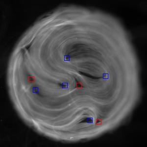
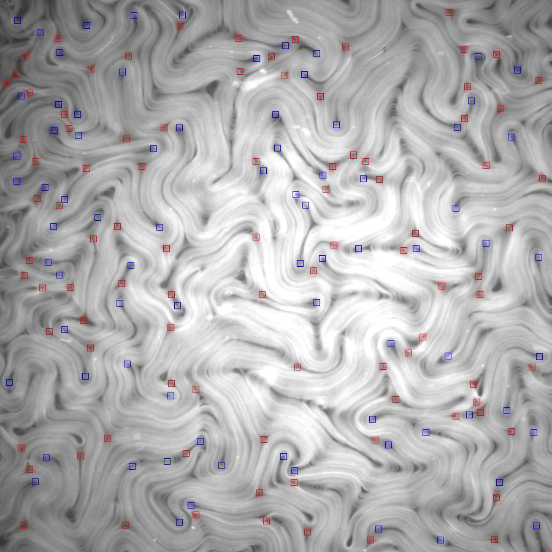
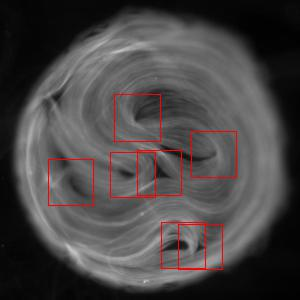
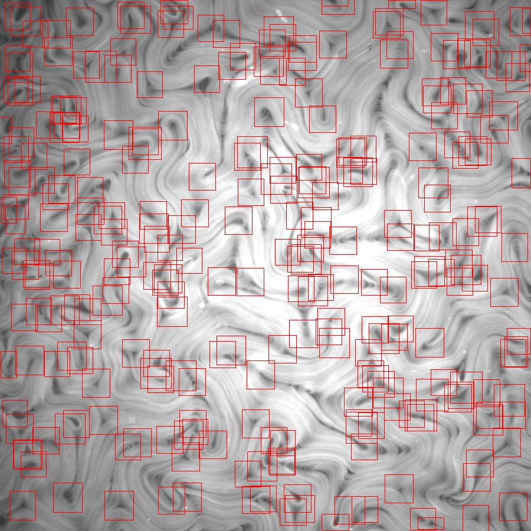

# Defect Detection Pipeline

Pipeline for positive and negative defect detection in active nematics.
This repository includes code for detection and visualization.

<p float='left'>
    
    
</p>

Improvements from previous implementation:
- Support for multiple GPUs and CPU
- Optimized custom data loader for detection
- Visualization tools
- Organized and documented code

## Getting started
Install dependencies with pip:
```
pip install -r requirements.txt
```

Download pre-trained weights [here](https://drive.google.com/drive/folders/1FE28rAh88YuCtu8LZ7Zh_yY_yYcJ5hRP?usp=sharing)

## Detection
1. To specify input images, create a .csv file with one row.
In the given example, ```img_paths.csv``` consists of two image paths:
    ```csv
    path
    images/confined.jpg
    images/unconfined.jpg
    ```
2. (Optional) Run YOLO model to quickly propose regions with high probability,
    save results to ```yolo.csv```
    ```bash
    python yolo_detect.py --pth models/yolo.pth \
                          --images img_paths.csv \
                          --output yolo.csv
    ```
3. (Optional) Visualize YOLO results, save output in the current directory
    ```bash
    python visualize.py --yolo yolo.csv --save .
    ```
    <p float='left'>
        
        
    </p>
4.  Run defect detection, save results to ```defects.csv```
    ```bash
    python detect.py --hard models/res18_hard.pth \
                     --uniform models/res34_uniform.pth \
                     --integrator models/integrator.pth \
                     --images img_paths.csv \
                     --yolo yolo.csv \
                     --output defects.csv
    ```
5. (Optional) Visualize defects, save output in the current directory
    ```bash
    python visualize.py --defects defects.csv --save .
    ```
    